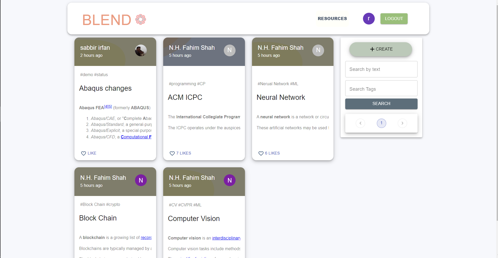
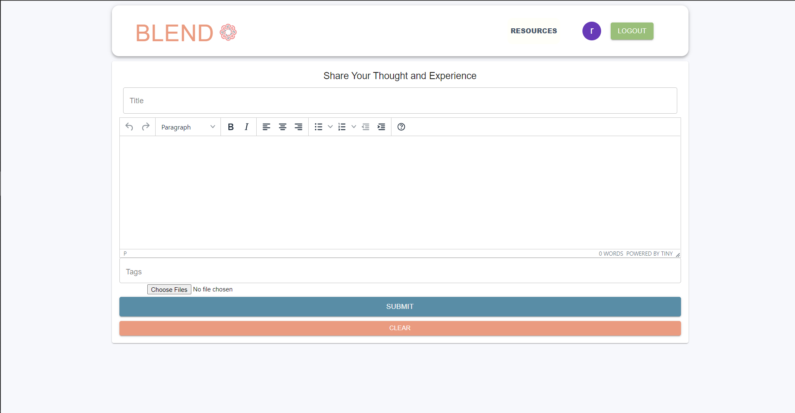
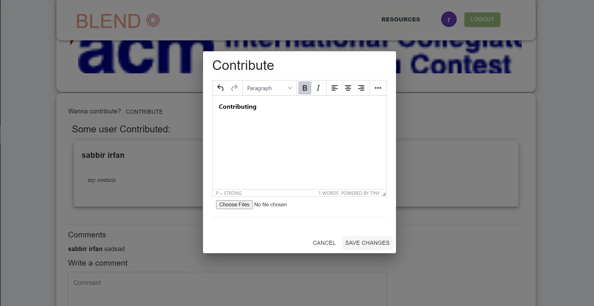
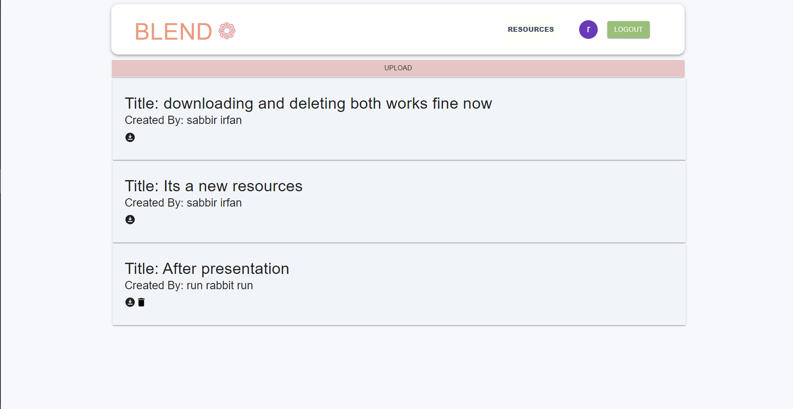

# Blend: Connecting People With Ideas & Resources <a href="https://adorable-capybara-0d3f06.netlify.app/" >Live Link</a>


## Introduction
<b>Let's Innovate Together</b>  

Every year, many undergrad students do research work and make awesome projects and many of them publish their work in national or international journal and conference. Also, many of them put their journal in the archive. As a student of 3rd year or 4th year, many of us want to know what researches our seniors have done in the certain field and what resources helped them but many of them left Sylhet. Due to lack of communication and their busy work schedule we don't know much about their paper or thesis. Here comes our Project and thesis archive system where anyone from opening an account can showcase their projects, share related resources, github repo, published paper links. Anyone can achieve their paper with proper title and tags.


## Motivation & Goals :
<ul>
<li>Connect to the people with similar research field. </li>
<li>Showcasing work with shared resources, Github repository , Published paper links etc.</li>
<li>Making research more easier.</li>

</ul>

# Youtube Link of how our app works:
Blend <b>[ [watch now](https://www.youtube.com/watch?v=zpsBOG4T3QY) ] </b>

## Features Implemented
<ul>
<li>Write a blog post</li>
<li>Update post</li>
<li>Delete own post</li>
<li>Like & Comment on a post</li>
<li>Authentication</li>
<li>Related topic recommendation</li>
<li>A User Friendly UI for Users</li>
<li>Search using tags and keywords</li>
<li>Easy Update / Edit post</li>
<li>User Profile</li>
<li>Update Profile</li>
<li>Change Username</li>
<li>Change Organization</li>
<li>Change Profile Picture</li>
<li>Contact info of user (optional)</li>
<li>Multiple and single File Upload and ownload</li>
</li>
</ul>

## Used Technologies:
* Framework:
  * React.js
  * Node.js
  * Express.js
* Database:
  * MongoDB Atlas

## Clone this Project:
```
git clone https://github.com/NaimulHasanFahim/BlogAndArchieveUsingMERN
```

## Run the Project 

Create two command prompt in vs code terminal.
In the First terminal :
```
cd client
npm i && npm start
````
In the second terminal :
```
cd server
npm i && npm start
```

# Some Snapshots:
<p  align="center"  >
 </p>


<p  align="center"  >
 </p>

<p  align="center"  >
 </p>


<p  align="center"  >
 </p>


<p  align="center"  >
 </p>

# Authors 
<br>
- <b><a href="https://github.com/NaimulHasanFahim">Naimul Hasan</a></b> <br>
- <b><a href="https://github.com/SabbirIrfan">Sabbir Irfan</a></b>
